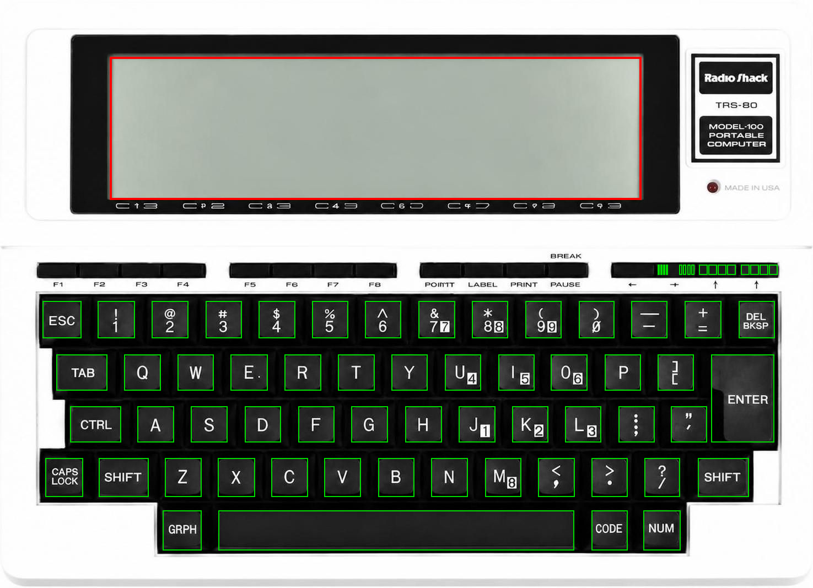

# M100e — a TRS-80 Model 100 emulator

An original, written-from-scratch emulator of the Radio Shack TRS-80
Model 100 portable computer.  The screen shows the actual machine: the
photo is the case, the LCD area is the live 240×64 display, and your
keyboard is wired straight into the Model 100's key matrix.



## Features

- **Full machine emulation** — cycle-counted 80C85 CPU, ten HD44102 LCD
  drivers, the real 9×8 scanned keyboard matrix, 81C55 PIO/timer,
  uPD1990AC clock (follows your host time), piezo beeper, IM6402 UART.
- **Runs the real ROM software** — BASIC, TEXT, TELCOM, ADDRSS, SCHEDL,
  with battery-backed RAM (8/16/24/32K) that persists across runs.
- **True dot-matrix LCD** — every pixel is a discrete dot with the faint
  ghost grid of the real panel, plus a working contrast wheel
  (Ctrl+Up / Ctrl+Down).
- **Internet over the modem and RS-232** — TELCOM pulse-dials real TCP
  connections to telnet BBSes; the serial port bridges to any host:port.
- **Simulated printer** — LPRINT/print jobs are rendered to PDFs in the
  `printer/` folder.
- **File exchange** — import/export `.BA` (tokenized both ways), `.DO`
  text and `.CO` machine code straight into the RAM file system.
- **Option ROM socket** — run TS-DOS, Super ROM, Multiplan and friends.
- **Built-in debugger** — registers, live disassembly, memory view,
  breakpoints and single-step (Ctrl+F2).
- **Hover help** — mouse over any key on the case to see which PC key
  drives it.

## Running

Requirements: Python 3.10+, `pygame`, `numpy` (and `tkinter` for the file
dialogs — normally part of Python).

```
python3 m100e.py          # fullscreen (Alt-Tab still works)
python3 m100e.py -w       # windowed
python3 m100e.py -w --load prog.co            # loads prog.co at startup
python3 m100e.py -w --load prog.co --debug    # ...with the debugger open
```

`--load` accepts a `.CO`, `.BA` or `.DO` file and injects it straight into
the RAM file system at boot - the same thing the emulator menu's **Load
program** does, just without needing the file dialog. That makes it easy
for an IDE to wire up a "run on real hardware" button (the Z8085 IDE's
toolbar does this with an "M100e" / "Debug" button pair; point it at this
checkout with the `M100E_PATH` environment variable if it isn't installed
at `~/M100e/m100e.py`).

On first run the emulator fetches the Model 100 system ROM (see **ROMs**
below), then cold-boots to the familiar menu: BASIC, TEXT, TELCOM,
ADDRSS, SCHEDL — all the real ROM software, running on an emulated
2.4576 MHz 80C85.

## ROMs

**This repository contains no ROM images.**  The Model 100's 32K system
ROM is Tandy/Microsoft code; it is preserved by the Model 100 community
but is not ours to redistribute, so the emulator obtains it at runtime
and keeps every ROM outside the repo (in `~/.m100e/`, which is also
git-ignored here along with `*.bin`/`*.rom`/`*.m12` files).

**System ROM (automatic).**  On first launch the emulator downloads the
community-preserved US Model 100 ROM from the Internet Archive's
[TRS-80 Model 100 software item](https://archive.org/details/trs-80-model-100),
verifies its SHA-256 checksum, and caches it at `~/.m100e/m100rom.bin`.
No setup needed — if the download can't complete, you'll be asked to
supply a ROM file yourself.

**System ROM (your own).**  Have a 32K dump of your own machine?
Right-click → **Load system ROM...** and pick the file (any 32,768-byte
image; `.bin`, `.rom`, `.m12`).  The choice is remembered in
`~/.m100e/config.json`.

**Option ROMs.**  The Model 100 has a socket under the machine for one
32K option ROM.  Right-click → **Load option ROM...**, pick the image,
and it stays "in the socket" across restarts until you eject it from the
same menu.  Start it the way a real one starts: it appears on the main
menu, or `CALL 63012` from BASIC.  The same archive.org item above
contains several period option ROM carts (Super ROM, Multiplan, IS-100,
UR-2/100, Analyst); the Club 100 / Bitchin100 community archives have
more (TS-DOS is the classic).  Files ending `.bin`, `.rom`, `.BX` or
`.m12` all load; short images are padded to 32K.

## Using it

- **Type normally.**  The PC keyboard maps positionally onto the Model 100
  matrix.  Hover the mouse over any key in the picture and a bubble shows
  which real key drives it (GRPH = Left Alt, CODE = Right Alt,
  PASTE/LABEL/PRINT/PAUSE = F9–F12, BREAK = Shift+F12, …).  Clicking a key
  with the mouse presses it too.
- **Right-click** (or Ctrl+F1) opens the emulator menu.
- **Ctrl+Up / Ctrl+Down** turn the LCD contrast wheel (persisted).  Crank
  it too far and the unlit dots darken, just like the real knob.
- Files live in battery-backed RAM, exactly like the real machine; the RAM
  image is saved to `~/.m100e/ram.bin` on exit and restored at startup.
  `POWER OFF` in BASIC really powers the machine down (press any key to
  power back on — files intact).

## Emulator menu

- **Load program** — `.BA` (ASCII BASIC is tokenized with the ROM's own
  keyword table; tokenized images are relocated), `.DO` text, `.CO`
  machine code.  Injected directly into the RAM file system, so they
  appear on the menu instantly.  **Export** goes the other way (.BA files
  are detokenized to readable source).
- **Option ROM** — load a 32K option ROM image into the socket (TS-DOS,
  Super ROM, …).  The archive.org item the system ROM comes from also
  contains several option ROM carts.  Eject it from the same menu.
- **Load system ROM** — run a custom 32K main ROM.
- **Memory** — 8K / 16K / 24K / 32K, populated from the top down like real
  RAM modules (changing it cold-starts the machine).
- **Serial & modem → internet:**
  - The **RS-232 port** bridges to `host:port` (menu-settable).  In TELCOM
    set `STAT 98N1E`, press `Term`, and you are online — the connection
    opens automatically.  Works with real telnet BBSes (telnet negotiation
    is handled).
  - The **modem** really pulse-dials: TELCOM clicks the phone relay and
    the emulator counts the pulses.  Map "phone numbers" to hosts in the
    dial directory (e.g. `1 → telehack.com:23`), set `STAT M7I1E`, and
    dial.  Carrier detect asserts while the socket is up; hanging up
    drops it.
  - Baud pacing can be authentic (characters arrive at the programmed
    baud rate) or fast.
- **Printer** — LPRINT/PRINT-to-printer output goes to a simulated
  printer that renders each job as a PDF (Courier, 80 columns, 66-line
  form-feed-aware pages) in the `printer/` folder.  A job "tears off"
  two seconds after the Model 100 stops printing, or when you quit.

## Debugging

**Ctrl+F2** opens a debugger overlay along the right edge of the screen —
registers, flags, a live disassembly around PC, and a memory dump — without
otherwise touching the machine (the Model 100 keeps running behind it).

| Key | Action |
|---|---|
| Ctrl+F2 | Open / close the debugger |
| Ctrl+F5 | Run ⇄ Pause |
| Ctrl+F10 | Step one instruction (auto-pauses) |
| Ctrl+F9 | Toggle a breakpoint (prompts for a hex address; blank = current PC) |
| Page Up / Page Down | Scroll the memory view by 128 bytes |
| Home | Snap the memory view to the current PC |

Breakpoints stop the CPU the instant PC lands on one of the marked
addresses (shown with `*` in the disassembly); Step then advances exactly
one instruction (or one interrupt acknowledgement) at a time, so you can
watch registers and memory change one opcode at a time. Pausing only
stops the CPU clock — the LCD, keyboard and menu keep working normally,
so you can still navigate the machine's own UI while paused.

## What's emulated

| Hardware | Implementation |
|----------|----------------|
| 80C85 CPU @ 2.4576 MHz | full instruction set incl. RIM/SIM, RST 5.5/6.5/7.5, cycle-counted |
| LCD | ten HD44102 drivers, chip-selects, pages, hardware scroll, read-modify-write |
| Keyboard | real 9×8 scanned matrix, strobed through the 81C55 |
| 81C55 PIO/timer | ports A/B/C, timer as UART baud clock and beeper tone source |
| Clock | uPD1990AC bit-banged serial protocol, follows host time (TIME$/DATE$ writes honored) |
| Beeper | timer tone mode and software-toggle mode, synthesized square wave |
| UART IM6402 | RX interrupts on RST 6.5, per-character pacing, modem/RS-232 mux |
| Modem | relay pulse-dial decoding, carrier detect, TCP bridge |
| RAM | 8–32K battery-backed, persisted across runs |
| ROM | genuine 32K system ROM + option ROM socket bank-switching |

Yes, the year shows 19xx — the ROM hardcodes the "19"; that's the Model
100's own famous Y2K quirk, faithfully reproduced.

## Tests

```
python3 tests/test_cpu.py         # 8085 core self-test + speed benchmark
python3 tests/test_boot.py        # boots the real ROM to the menu
python3 tests/test_keyboard.py    # types into BASIC through the matrix
python3 tests/test_features.py    # RAM sizes, files, option ROM, TELCOM/TCP, dialer
python3 tests/test_debugger.py    # disassembler, breakpoints, single-step
```

`tools/gen_layout.py` regenerates `assets/layout.json` (LCD rectangle and
key hitboxes) from the case photo, plus `layout_check.png` to eyeball the
result.
